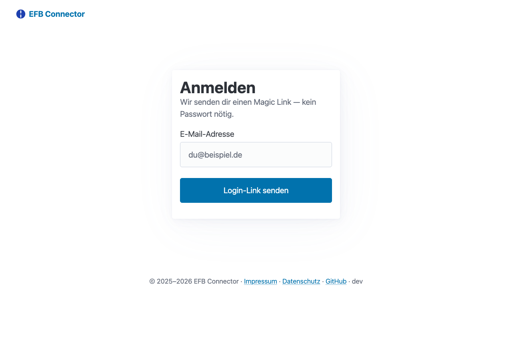
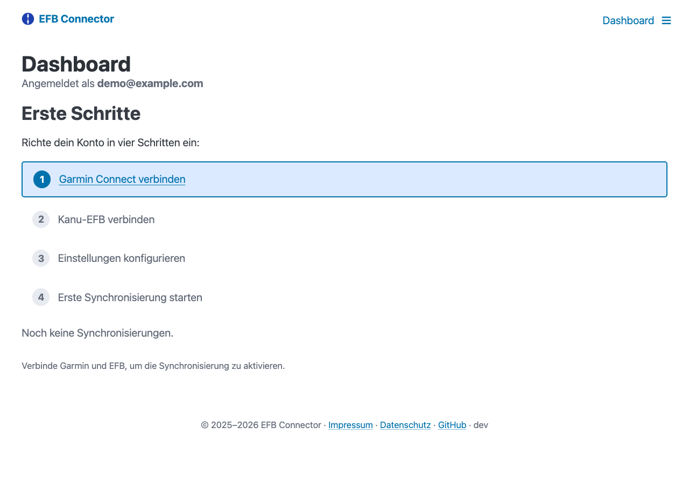
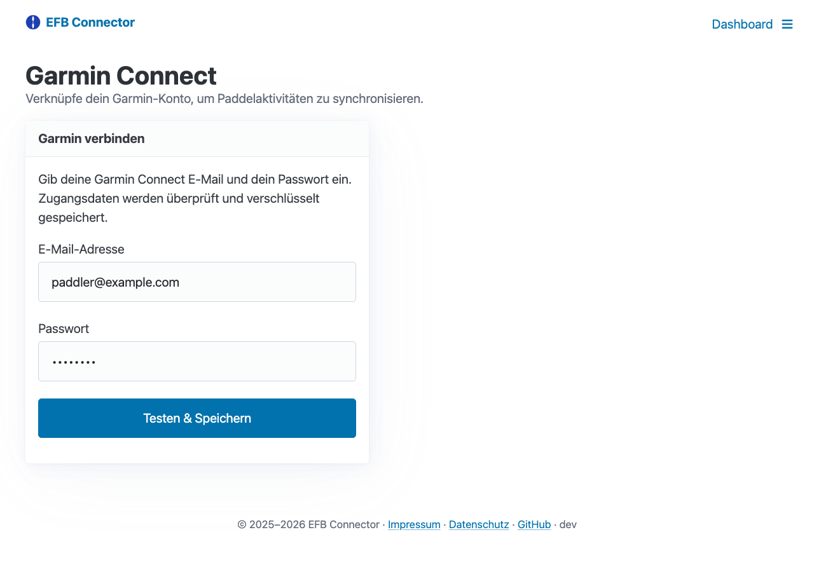
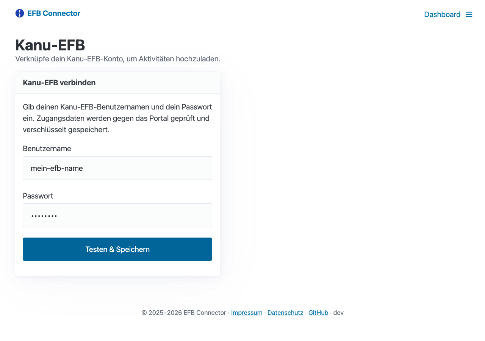
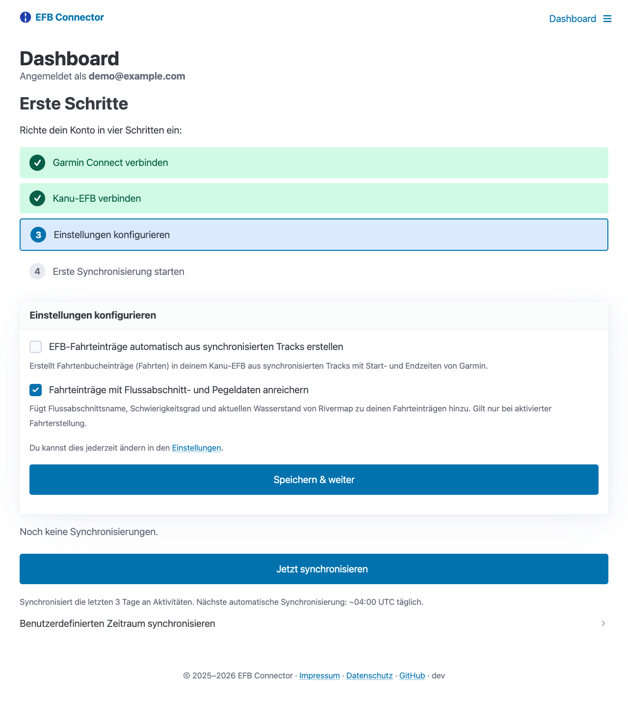
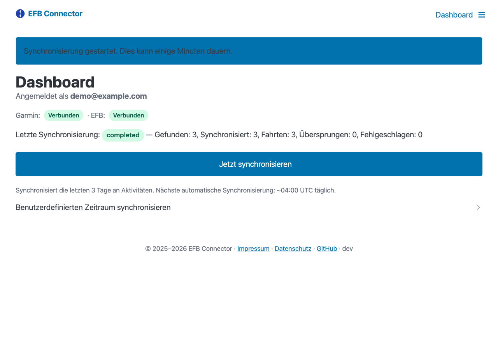
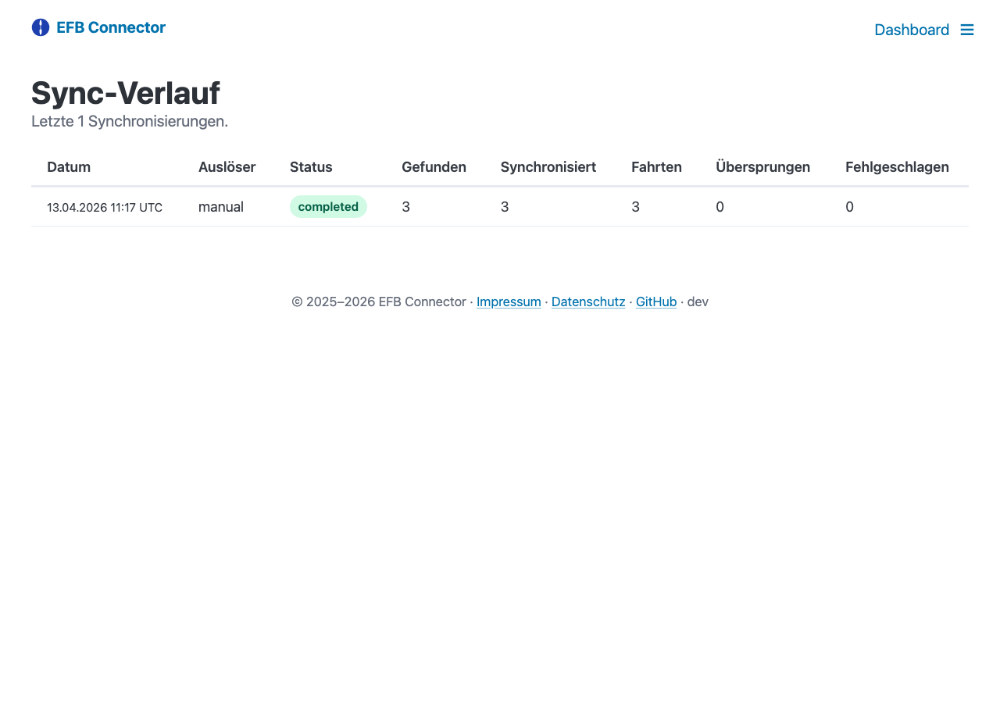
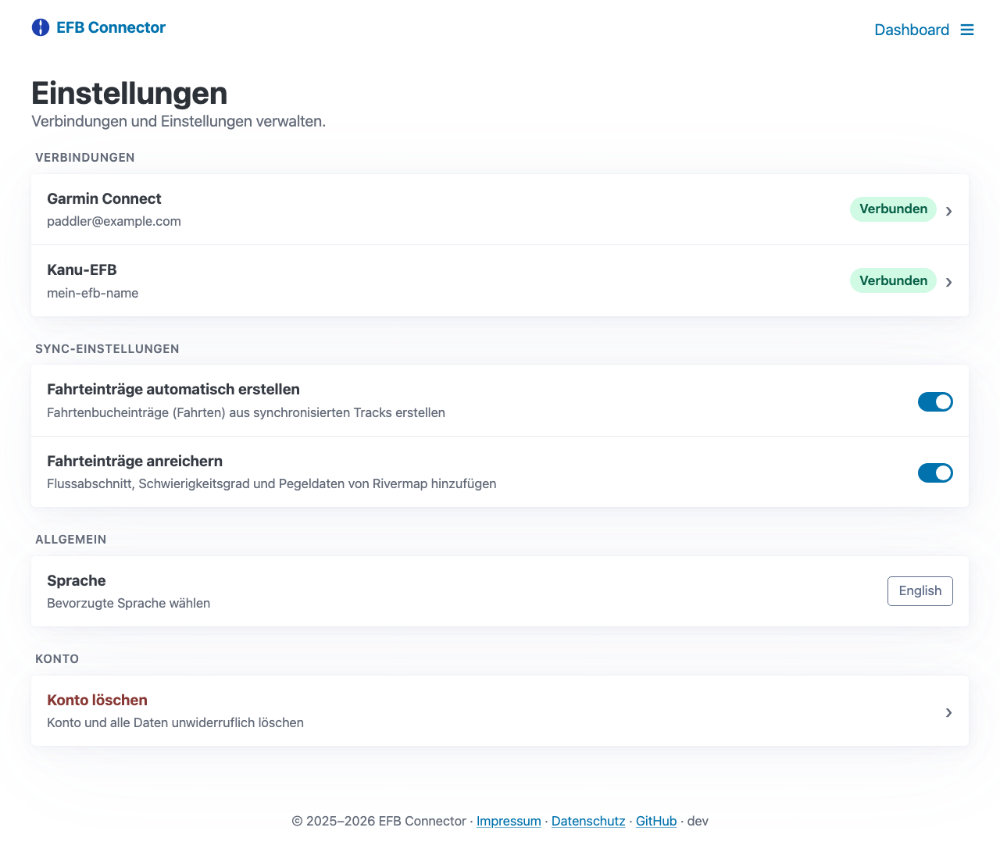

# EFB Connector: Garmin-Aktivitäten automatisch ins Fahrtenbuch übertragen

Paddeltouren aufzeichnen und automatisch im EFB-Fahrtenbuch dokumentieren — das ermöglicht der neue **EFB Connector** für alle, die eine Garmin-Sportuhr oder ein GPS-Gerät nutzen. Die Synchronisierung läuft täglich im Hintergrund.

## Was ist der EFB Connector?

Der EFB Connector ist ein kostenloser Dienst, der eure Paddelaktivitäten von **Garmin Connect** automatisch mit dem **Kanu-EFB** synchronisiert. Einmal eingerichtet, landen eure Touren jeden Tag im Fahrtenbuch — ohne manuelles Exportieren und Hochladen von GPX-Dateien. Der Dienst ist werbefrei und Open Source. Eure Zugangsdaten werden verschlüsselt gespeichert und können jederzeit gelöscht werden.

## Was kann der EFB Connector?

- **Tägliche automatische Synchronisierung** — läuft jeden Tag um ca. 06:00 Uhr
- **Manuelle Synchronisierung** — jederzeit per Knopfdruck im Dashboard
- **Automatische Fahrtenbucheinträge** — Fahrten werden direkt im EFB angelegt
- **Flussdaten-Anreicherung** — Flussabschnitt, Schwierigkeitsgrad und aktuelle Pegelstände werden automatisch ergänzt (Daten von Rivermap)
- **Passwortlose Anmeldung** — Login per Magic Link, kein Passwort nötig
- **Unterstützte Aktivitäten** — Kajak, Kanu, SUP, Rudern, Wildwasser-Rafting, Paddeln

## Schritt-für-Schritt Anleitung

### 1. Anmelden

Öffnet [efb-connector.sauroter.de](https://efb-connector.sauroter.de) und klickt auf „Anmelden". Gebt eure E-Mail-Adresse ein — ihr bekommt einen Login-Link per E-Mail zugeschickt. Kein Passwort nötig.

Nach dem Klick auf den Link in der E-Mail seid ihr angemeldet und seht das Dashboard mit dem Einrichtungsassistenten.

### 2. Garmin Connect verbinden

Klickt im Einrichtungsassistenten auf „Garmin Connect verbinden" und gebt eure Garmin-Zugangsdaten ein. Die Zugangsdaten werden verschlüsselt gespeichert.

### 3. Kanu-EFB verbinden

Im nächsten Schritt verknüpft ihr euer Kanu-EFB-Konto. Gebt euren EFB-Benutzernamen und euer Passwort ein.

### 4. Einstellungen wählen

Sobald beide Konten verbunden sind, könnt ihr die Sync-Einstellungen konfigurieren:

- **Fahrtenbucheinträge automatisch erstellen** — Erstellt automatisch Fahrten im EFB aus euren synchronisierten Tracks
- **Flussdaten anreichern** — Ergänzt Fahrteinträge mit Flussabschnitt, Schwierigkeitsgrad und aktuellen Pegelständen

### 5. Erste Synchronisierung starten

Klickt auf „Jetzt synchronisieren", um eure aktuellen Garmin-Aktivitäten sofort zu übertragen. Danach läuft die Synchronisierung jeden Tag automatisch.

### 6. Sync-Verlauf einsehen

Im Sync-Verlauf seht ihr alle vergangenen Synchronisierungen mit Status, Anzahl der gefundenen und übertragenen Aktivitäten sowie erstellten Fahrten.

## Alle Einstellungen im Überblick

Auf der Einstellungsseite könnt ihr jederzeit eure verbundenen Konten verwalten, Sync-Einstellungen ändern, die Sprache wechseln oder euer Konto löschen.

## Jetzt ausprobieren

Der EFB Connector ist kostenlos, werbefrei und Open Source.

**[efb-connector.sauroter.de](https://efb-connector.sauroter.de)**
